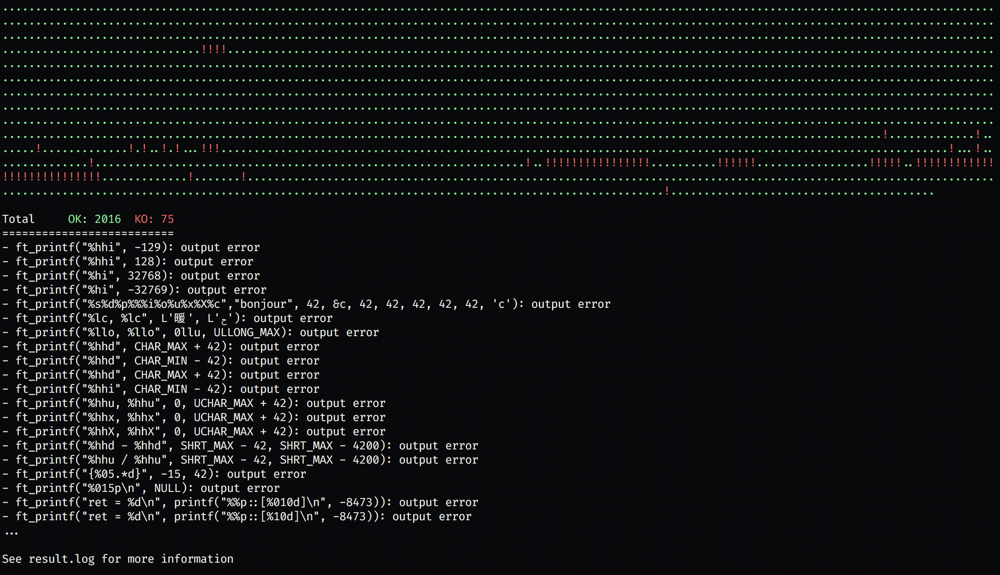

# ft_printf test

Unit test for the ft\_printf project of 42 school.



## Usage

Clone this repo such that:

```
`
|- ft_printf_test/
|- ft_printf/
```

or modify the `FT_PRINTF_PATH` variable in the Makefile

- `> make run`: run the tests in a pretty format
- `> make verbose`: to show a more verbose output
- `> make quiet`: to show a more quiet output
- `> make raw`: run the tests in a ugly but parsable format
- `> python3 prettier -h`: show prettier options
- `> make generate`: generate 100 random test

### Bonus

All the previous `make` command suffixed with `bonus` (i.e `make runbonus`). You may need
to `make fclean` in order to clean the previous .o files.

## Random Test Generator

It will generate random test according to the `-Wformat` flag of gcc.

- `> ./generate -n [number of tests]`: generate n test
- `> ./generate -h`: show all available options

### Bonus

Add the `--bonus` flag i.e: `> python3 generate.py -n [number of tests] --bonus`.

## Memory leaks check

You have to install [valgrind](http://valgrind.org/) with [brew](https://brew.sh/),
[here](https://stackoverflow.com/questions/35775102) is a nice thread to install it
locally if you don't have root access. You can then run `> brew install valgrind`.

- `> make check_leaks`: run valgrind on a test (without the test themself).
- `> make check_leaks_verbose`: add `--leak-check=full` to valgrind.

## Credits

- [moulitest](https://github.com/yyang42/moulitest) by yyang42
- [pft](https://github.com/gavinfielder/pft) by gavinfielder
- [printf\_tester](https://github.com/AntoineBourin/printf-tester) by AntoineBourin
- [printf\_tests](https://github.com/BartMassey/printf-tests) by BartMassey
- @MrHade for the no bonus test.
